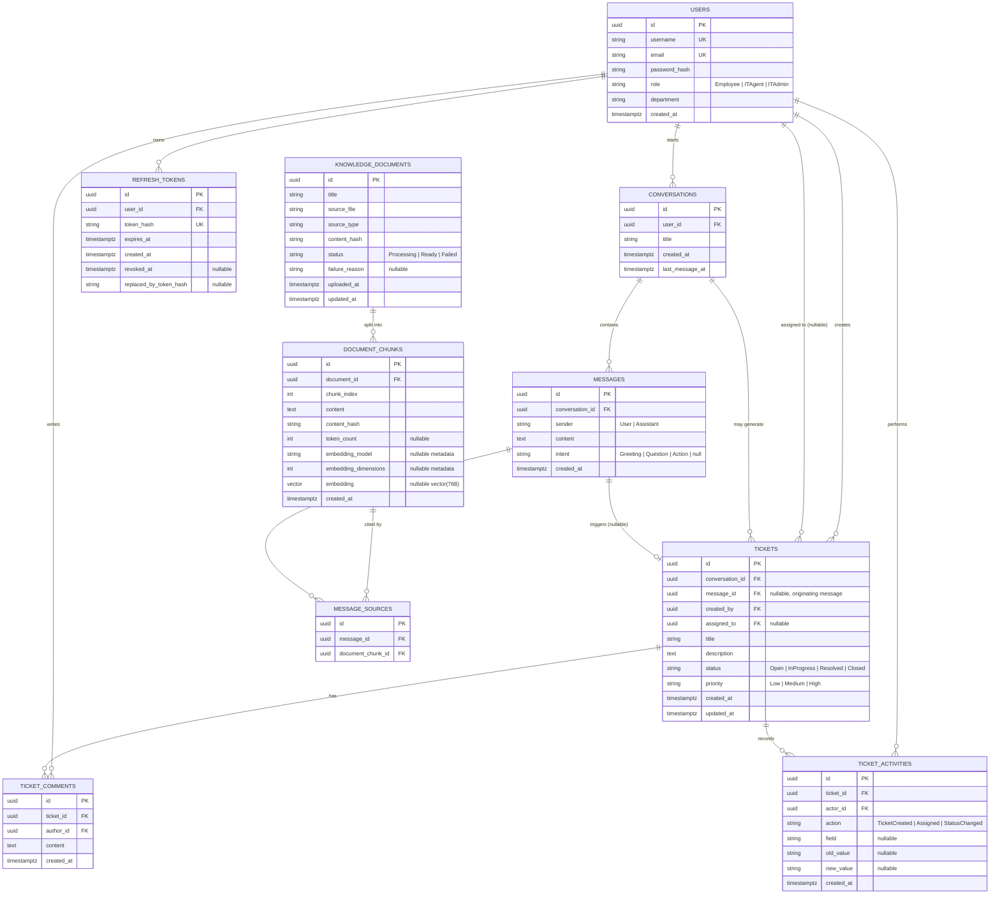

# Entity-Relationship Diagram: AI-Powered IT Helpdesk & Ticketing

Database: **PostgreSQL 16** with the **`pgvector`** extension enabled
(`CREATE EXTENSION IF NOT EXISTS vector;`).

---

## Diagram (Mermaid)

---

## Table Notes

### `users`
- `password_hash` stores a BCrypt/Argon2 hash — never plaintext, never logged.
- `role` is an enum-backed string (`smallint` in the DB via EF Core's enum-to-int
  conversion is also acceptable; string is friendlier for ad-hoc queries/debugging).

### `refresh_tokens`
- Stores only a SHA-256 hash of each refresh token; the raw token is returned to the client once and never persisted.
- Login creates a refresh token row. `POST /auth/refresh` rotates tokens by revoking the old row and storing the replacement hash in `replaced_by_token_hash` for auditability.
- Expired or revoked refresh tokens are rejected in the Application layer before issuing a new access token.

### `conversations`
- `last_message_at` is denormalized onto the conversation for cheap sorting in the
  conversation list endpoint (avoids a join + aggregate on every list call).

### `messages`
- `intent` is nullable because assistant messages don't have an intent — only
  user messages get classified.

### `tickets`
- New tickets start as `Open`, with `Medium` priority unless the creating use case supplies a different priority.
- `attachments` stores a JSON metadata array for future uploads (for example file name, content type, size, storage key). Actual file bytes should live in object storage or a file service, not in the `tickets` row.
- At most one ticket should be created per conversation in the current product flow. `message_id` still links back to the specific latest/user message that triggered ticket creation, for
  audit/traceability (`"why was this ticket opened?"`).
- Status transitions are enforced in the **Application layer** (a `TicketStatusTransition`
  policy), not just as a loose string column — invalid transitions (e.g. `Closed →
  InProgress` without going through re-open logic) return `409 Conflict`.

### `ticket_comments`
- Comments are linked to both the ticket and author so future list/detail endpoints can enforce owner/staff access while preserving an audit trail.

### `ticket_activities`
- Records audit events for ticket creation, assignment changes, and status changes.
- `actor_id` stores the user who performed the change. `old_value` and `new_value` store compact string snapshots so the log remains understandable even if the ticket changes again later.

### `knowledge_documents` / `document_chunks`
- Current implemented foundation stores documents, ordered text chunks, embedding metadata,
  and nullable vectors in `document_chunks.embedding vector(768)`. `embedding_model` and
  `embedding_dimensions` record which model produced each vector so reindex/debugging can
  identify stale embeddings.
- The schema enables PostgreSQL `pgvector` with `CREATE EXTENSION IF NOT EXISTS vector;`.
  The current vector dimension is 768 because `Embedding:Dimensions` is configured to 768.
  If this dimension changes, all existing chunks must be re-embedded into a matching column.
- Vector index: `CREATE INDEX IX_document_chunks_embedding_hnsw ON document_chunks USING hnsw (embedding vector_cosine_ops) WHERE embedding IS NOT NULL;`
  for approximate nearest-neighbor cosine search.
- `chunk_index` preserves order within a document and is unique per document, useful for
  reconstructing context or debugging retrieval quality. Pasted text is chunked server-side
  by Markdown headings first, then by long-section word windows with overlap.
- `content_hash` supports idempotent ingestion/re-indexing and duplicate detection.

### `message_sources`
- Join table so a single assistant message can cite multiple chunks (and, in principle,
  a chunk could be cited by many messages). Powers the `sourceDocuments` field returned
  in the chat API (see `docs/API_SPEC.md`).

---

## Authorization boundary reflected in the schema

There is no `hospital_id`-style tenant column here (single-tenant app), but the same
*principle* from the reference assignment applies: **scoping is enforced by foreign key
ownership, not by trusting client input.**

- Employees: `WHERE conversations.user_id = @currentUserId` / `WHERE tickets.created_by = @currentUserId`
- IT Agents: `WHERE tickets.assigned_to = @currentUserId OR tickets.assigned_to IS NULL`
  (their queue), enforced in the query handler, never passed in as a filter the client
  controls.
- IT Admins: no additional `WHERE` scoping beyond soft-delete/tenant flags (none needed
  here).

This logic lives in the **Application layer's query handlers** (e.g.
`GetTicketsQueryHandler`), which is the .NET-equivalent home for what the reference
assignment implements as PostgreSQL Row-Level Security policies in a Supabase-based
stack. Either approach is valid; this project chooses application-layer enforcement
because Clean Architecture keeps that logic testable without a live database, and the
team already reviews it there in code review.

---

## Migration ownership

All schema changes go through **EF Core Migrations** (`dotnet ef migrations add ...`),
generated from `Infrastructure/Persistence/Configurations/*` Fluent API configs — never
hand-edited SQL against a running database, so the migration history stays the single
source of truth for schema evolution.

