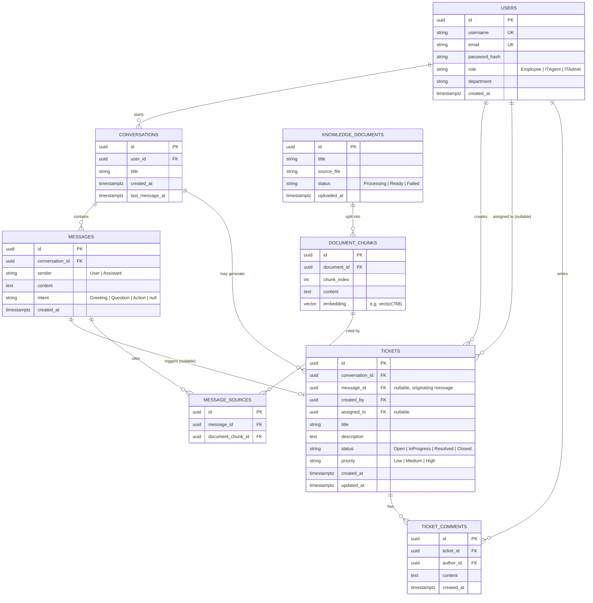

# Entity-Relationship Diagram: AI-Powered IT Helpdesk & Ticketing

Database: **PostgreSQL 16** with the **`pgvector`** extension enabled
(`CREATE EXTENSION IF NOT EXISTS vector;`).

---

## Diagram (Mermaid)

---

## Table Notes

### `users`
- `password_hash` stores a BCrypt/Argon2 hash — never plaintext, never logged.
- `role` is an enum-backed string (`smallint` in the DB via EF Core's enum-to-int
  conversion is also acceptable; string is friendlier for ad-hoc queries/debugging).

### `conversations`
- `last_message_at` is denormalized onto the conversation for cheap sorting in the
  conversation list endpoint (avoids a join + aggregate on every list call).

### `messages`
- `intent` is nullable because assistant messages don't have an intent — only
  user messages get classified.

### `tickets`
- `message_id` links back to the specific message that triggered ticket creation, for
  audit/traceability (`"why was this ticket opened?"`).
- Status transitions are enforced in the **Application layer** (a `TicketStatusTransition`
  policy), not just as a loose string column — invalid transitions (e.g. `Closed →
  InProgress` without going through re-open logic) return `409 Conflict`.

### `knowledge_documents` / `document_chunks`
- `embedding` uses `pgvector`'s `vector(n)` type, where `n` matches the chosen embedding
  model's output dimensionality (e.g. 768 for `nomic-embed-text-v1_5` — **confirm the
  exact dimension against the model actually configured** before writing the migration,
  since getting this wrong means re-embedding everything).
- Index: `CREATE INDEX ON document_chunks USING hnsw (embedding vector_cosine_ops);`
  (or `ivfflat` depending on the pgvector version available) for fast approximate
  nearest-neighbor search.
- `chunk_index` preserves order within a document, useful for reconstructing context or
  debugging retrieval quality.

### `message_sources`
- Join table so a single assistant message can cite multiple chunks (and, in principle,
  a chunk could be cited by many messages). Powers the `sourceDocuments` field returned
  in the chat API (see `docs/API_SPEC.md`).

---

## Authorization boundary reflected in the schema

There is no `hospital_id`-style tenant column here (single-tenant app), but the same
*principle* from the reference assignment applies: **scoping is enforced by foreign key
ownership, not by trusting client input.**

- Employees: `WHERE conversations.user_id = @currentUserId` / `WHERE tickets.created_by = @currentUserId`
- IT Agents: `WHERE tickets.assigned_to = @currentUserId OR tickets.assigned_to IS NULL`
  (their queue), enforced in the query handler, never passed in as a filter the client
  controls.
- IT Admins: no additional `WHERE` scoping beyond soft-delete/tenant flags (none needed
  here).

This logic lives in the **Application layer's query handlers** (e.g.
`GetTicketsQueryHandler`), which is the .NET-equivalent home for what the reference
assignment implements as PostgreSQL Row-Level Security policies in a Supabase-based
stack. Either approach is valid; this project chooses application-layer enforcement
because Clean Architecture keeps that logic testable without a live database, and the
team already reviews it there in code review.

---

## Migration ownership

All schema changes go through **EF Core Migrations** (`dotnet ef migrations add ...`),
generated from `Infrastructure/Persistence/Configurations/*` Fluent API configs — never
hand-edited SQL against a running database, so the migration history stays the single
source of truth for schema evolution.
